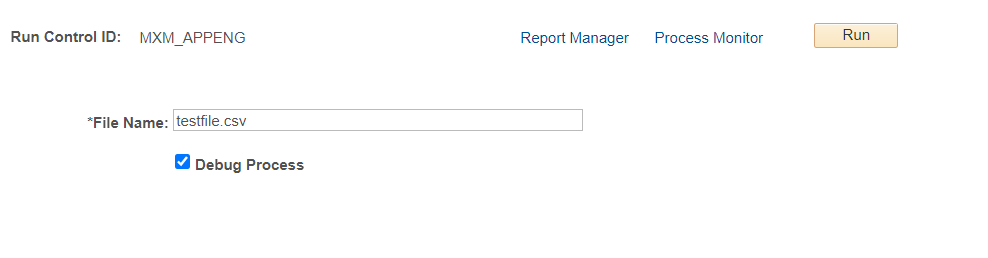

# Peoplesoft - How to pass variable to an Application Engine
All the required PeopleSoft objects to pass variables to an application engine program.

A Step by step guide can be viewed at: https://tshenolo.me/blog/How-to-pass-variable-to-an-Application-Engine



## How to Install
### Step 1: Import the custom menu and folder
1. Launch Application Designer 
2. click Tools, Copy Project, From File...   
3. click Select, choose MXM_CUSTOM_INIT
4. click Copy

### Step 2: Import the project
1. Launch Application Designer
2. Click Tools, Copy Project, From File...   
3. Click Select, choose MXM_APPENG
4. Click Copy

### Step 3. Build Project 
Note: Perform this step if the project contains SQL Tables otherwise skip it
1.	Click Build, Project...
2.	Check the following options:  
    a.	Create Table  
    b.	Create Indexes  
    c.	Create Views  
    d.	Execute and build script.  
3.	Click Build

### Step 4. Register the component
1. Open the component
2. Click Tools, Register Component...
3. Check off the following:
   - Add this component to a menu
   - Add this component to a portal registry
   - Add this component to a permission list
4. Click Next
5. Select Menu Name: MXM_CUSTOM_MENU and Bar Name: USE
6. Click Next
7. Select Folder Name: MXM_CUSTOM
8. Change Content Reference Label and Long Description fields to "App Engine Variables"
9. Check off Always use default local node
10. Click Next
11. Select Permission List Name: PTPT1200
12. Click Next
13. Check off Registry entry under Add to project
14. Click Finish


## Technical Documentation
### App Designer Project: MXM_APPENG

### Records	
Record: MXM_APPENG_AET  
Type: Derived/Work
| Field | Type | Length | Long Descr | Short Descr |
| ------| --------- | --------- | --------- | --------- |
| PROCESS_INSTANCE | Nbr | 10 | Process Instance | Instance |
| AE_SECTION | Char | 8 | Section | Section |
| AE_APPLID | Char | 12 | Program Name | Program |
| RUN_CNTL_ID | Char | 30 | Run Control ID | Run Cntl |
| OPRID | Char | 30 | User ID | User |
| FILENAME | Char | 80 | File Name | File Name |
| DEBUG | Char | 1 | Show Program Names | Debug |

Record: MXM_APPENG_RC  
Type: SQL Table
| Field | Type | Length | Long Descr | Short Descr |
| ------| --------- | --------- | --------- | --------- |
| RUN_CNTL_ID | Char | 30 | Run Control ID | Run Cntl |
| OPRID | Char | 30 | User ID | User |
| FILENAME | Char | 80 | File Name | File Name |
| DEBUG | Char | 1 | Show Program Names | Debug |

### Application Engine
App Engine: MXM_APPENG   
State Record: MXM_APPENG_AET    
Section: MAIN    
Section: GETPARAM  
Section: REPORT  

_  
Section: MAIN  

Step: 001  
Action: Call Section  
Section Name: GETPARAM  
  
Step: 002  
Action: Call Section  
Section Name: REPORT  

_   
Section: GETPARAM  
Step: 001  
Action: SQL  

```
%Select(OPRID, RUN_CNTL_ID, FILENAME, DEBUG)   
 SELECT OPRID   
 , RUN_CNTL_ID   
 , FILENAME   
 , DEBUG  
  FROM %Table(MXM_APPENG_RC)   
 WHERE OPRID = %OperatorId   
   AND RUN_CNTL_ID = %RUNCONTROL
```

_   
Section: REPORT  
Step: 001  
Action: PeopleCode  

```
MessageBox(0, "", 0, 0, "FILENAME: %1", MXM_APPENG_AET.FILENAME.Value);
MessageBox(0, "", 0, 0, "DEBUG: %1", MXM_APPENG_AET.DEBUG.Value);
```


### Pages

Page:MXM_APPENG   
Title: App Engine Variables   
MXM_APPENG_RC.FILENAME    
MXM_APPENG_RC.DEBUG   
  

### Component

| Component | MXM_APPENG | 
| ------| --------- |
| Page | MXM_APPENG | 
| Navigation | Custom Components > App Engine Variables | 
| Item Label | App Engine Variables | 
| Search Record | PRCSRUNCNTL |
| Add | Selected | 
| Update Display | Selected |
| Disable Saving Page | Selected | 
| Menu | MXM_CUSTOM_MENU |
| Bar item Name | MENUITEM | 
| Portal | Employee |
| Folder Name | MXM_CUSTOM | 
| Content Reference label | App Engine Variables |
| Long Description | App Engine Variables | 
| Sequence Number | 0 |
| Always Use Local Node | Selected | 
| Permission Lists | PTPT1200 |
| Actions | Add, Update/Display |


## Process Definition

Navigation: PeopleTools > Process Scheduler > Processes  

Process Type: Application Engine  
Name: MXM_APPENG  

Process Definition Options  
Component: MXM_APPENG  
Process Groups: TLSALL  


 